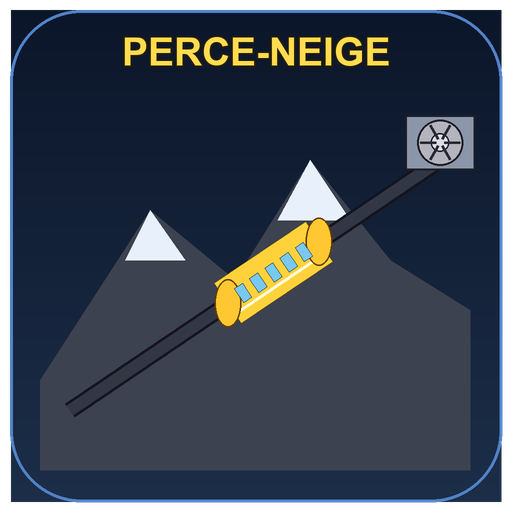

# Perce-Neige Simulator


**Drive the longest funicular in France — 3 474 m of underground tunnel from Val Claret (2 111 m) to the Grande Motte glacier (3 032 m) in Tignes, France.**

An accurate PyQt6 simulation of the *Perce-Neige* underground funicular (built 1989–1991, opened 14 April 1993 by Von Roll / CFD). Distant descendant of the author's 2006 TI-84 `FUNIC` program — same spirit, real physics, proper graphics.

---

## Features

### Real-world fidelity
- **Slope length** 3 474 m (cockpit counter reference), **vertical drop** 921 m, altitudes 2 111 m → 3 032 m
- **Gradient profile** from 8 % (gentle square-section start) to 30 % (steepest sustained middle), eases to 6 % at the upper square-section platform — calibrated directly against the real cockpit video
- **Square cut-and-cover** at both ends (s < 257 m and s > 3 420 m), **round TBM bore** through the middle — exact transition distances read from the on-board counter
- **Passing loop** s=1 601 → 1 823 m, curves at s=1 297 → 1 541 m and s=1 884 → 2 369 m
- **Speed** capped at 12 m/s (43.2 km/h) — the Von Roll regulator limit. In the reference cockpit video the driver cruises at ~10.1 m/s (speed_cmd ≈ 84 %), giving the real 7 min 54 s Val Claret → Grande Motte trip time ; you can push to full 12 m/s in the sim.
- **Train** : two coupled cylindrical cars, ∅ 3.60 m, 32 t empty, up to 334 passengers (58.8 t max)
- **Motors** 3 × 800 kW DC at the upper drive station, below the *Panoramic* restaurant
- **Cable** 52 mm Fatzer, nominal 22 500 daN, breaking 191 200 daN

### Physics
- Variable-gradient integration with position-dependent slope
- Mass-aware gravity, rolling resistance, motor force with `P = F·v` envelope
- Normal brake (2.5 m/s²) and emergency brake (5 m/s²)
- Live **cable tension** estimate with nominal / warning / breaking bands
- **Comfort score** via jerk integration
- **Energy score** in kWh

### Interface
- Faux-3D side view with yellow cylindrical cabins, coupled cars, windowed body, highlight strip, rounded end caps
- Animated **drive station cutaway** at the upper platform — three DC motors feeding a rotating drive pulley, cable visibly wrapping
- **Mini-map** across the top showing both trains' positions and the passing loop
- **Analog speedometer** in m/s (with km/h sub-label) + **tension gauge** in daN, both with green/yellow/red bands
- **Bar gauges** for speed command (% of V_MAX), brake, and motor power
- **Realistic cockpit button panel** — illuminated push-buttons for electric stop, emergency stop (red mushroom), dead-man vigilance, headlights, cabin lights, horn, doors, autopilot and sound
- Warning lights: doors, brake, cable, fault, speed limit
- **Scrolling snow** across the view, cosmic gradient sky
- **Event log** with FR/EN messages
- Fully **bilingual FR / EN**, auto-detected from system locale (toggle with `L`)

### Realistic driving regulator
- The driver sets a **speed command** (percentage of V_MAX = 12 m/s) with `↑` / `↓` — the regulator smoothly tracks it with a realistic accel/decel envelope, exactly like the real Von Roll speed programmer
- **Programmed station approach** : the envelope automatically clamps the setpoint so the train always has enough distance to reach the creep zone before the platform
- **Creep zone** : when the front is 20 m before the platform, the train crawls at 1 m/s through the 20 m approach and the 35 m platform, stopping flush at the platform end
- **Counterweight wagon** : the descending train *is* the counterweight — mechanically linked by the cable. In real operation the down-going wagon is almost always empty because skiers go *up* by funicular and come *back down on skis*; only the summer glacier season sees a handful of passengers coming down. The ascending train therefore has to lift close to a full load of net imbalance
- **Cable elasticity rebound** : after the main train stops at the upper station, the counterweight wagon at Val Claret creeps up ~1.2 m over 2 seconds because the long cable relaxes (motor is at the top)
- **Dead-man vigilance** : the driver must touch a control at least once every 20 s, otherwise the system triggers an automatic electric stop (press `G` to acknowledge)

### Cabin first-person view (F4)
- **Real pinhole-camera perspective** — `screen_r = focal · R_tunnel / d`
  with a 72° horizontal FOV, matching the wide driver windshield and the
  tight 3.1 m TBM bore
- TBM segment pitch 1.5 m : at 12 m/s, 8 rings stream past every second,
  with the correct 1/d size falloff that makes near walls fill the view
- **Wall fluorescents** : long horizontal tubes (~1.6 m, spaced 12 m)
  on the left wall while climbing / right wall while descending —
  layered halo + mid-glow + bright core, exactly like the HD footage
- **Headlights gate visibility** : off → you barely see a few metres of
  concrete and only the wall neons as beacons ; on → the beam reaches
  ~260 m with Beer-Lambert exponential falloff, far enough to actually
  *see* the tunnel curving up or down through the gradient breaks
- Sleepers drawn one per ring with a central cable-guide bolt, rails +
  cable guide connect smoothly between consecutive rings
- Correct handling of curves (lateral offset `½·focal·κ·d`) and passing
  loop double-bore on the opposite wall
- **Exact 3D vertical curvature** — every tunnel ring, wall panel,
  platform edge and ghost-wagon vertex is projected through a true
  pinhole camera frame (forward + altitude difference rotated by the
  local slope pitch), so a gradient break ahead is rendered with the
  same geometric fidelity as a horizontal turn
- **Continuous floor / ceiling / arch envelope polylines** drawn across
  successive rings give vertical curvature the same visual clarity that
  rail continuity gives to horizontal turns

### Side-profile view (default)
- **Researched gradient profile** — 15 % at Val Claret ramp-up, 30 %
  sustained in the mid-tunnel main climb, 12 % easing out onto the
  Grande Motte glacier platform, pronounced break at ~3 180 m
- **Mouse-wheel zoom** (or `+` / `-` / `0` to reset) with an aspect-ratio
  lock : the visual slope angle is exactly the real slope angle at any
  zoom level — zooming reveals more detail without distorting steepness
- **Distance + elevation readout** : `travel / total m` and `Δalt / total m`
  are trip-relative (0 at departure platform, full span at arrival),
  direction-aware for descending trips

### Game modes
- **Normal** — just drive a trip
- **Challenge** — optimise time + comfort + energy
- **Faults** — random incidents : cable tension spikes, motor thermal, door faults, smoke alarm, icy upper section

### Auto-update (GitHub)
- Background check on startup (3 s after launch) — silent unless an
  update is available
- Manual check via **Help → Check for updates**
- Downloads the release zipball from GitHub, validates size, rejects
  path-traversal and symlinks, copies a whitelist of files and restarts
- User data (venv, CLAUDE.md, `.git`, `crash_reports/`) is never touched

### Bug reports (anonymous)
- `sys.excepthook` writes an anonymized JSON crash report into
  `crash_reports/` if the app ever crashes
- Next launch offers to open a **pre-filled GitHub issue** — paths and
  user names are stripped before anything leaves your machine
- Manual report via **Help → Report a bug** : form with description +
  steps ; opens the same pre-filled issue URL in your browser
- **No telemetry** : nothing is sent automatically, nothing contacts a
  server without your explicit click

### Real cabin ambient sound
- Two long loops extracted from the real 10-minute HD cabin recording :
  a 25 s slow/approach segment and a 60 s steady-cruise segment,
  loudness-matched and crossfaded live based on the train's current
  speed — stops sound like stops, cruise sounds like cruise, no more
  11-second clip heard on repeat
- Volume ceiling lifted to ~95 % so the tunnel rumble actually feels
  like being inside the car

### Real on-board announcements
- Authentic recordings from the actual Perce-Neige cabins, bundled under
  `sons/Funiculaire perce neige/`
- Played automatically at the right moment : doors closing, welcome,
  minor/technical incident, 10 min stop, restart, evacuation, upstream
  passenger exit, dimmed lighting, brake noise, etc.
- 5 languages per message (FR / EN / IT / DE / ES) — the game picks the
  current UI language (FR or EN) and queues FR then EN like the real train.
- Press `N` at any time to mute / unmute.
- Press `F2` to open the manual announcement console : a 15-entry panel
  with hotkeys to trigger any message (doors closing, welcome, incident,
  evacuation, brake noise, …) on demand.

---

## Installation

**For everyone (recommended, no Python required)** — go to the [latest release](https://github.com/ARP273-ROSE/perce-neige-sim/releases/latest), download **`PerceNeigeSimulator-windows.exe`** and double-click it. Done. The app updates itself automatically when a new version is published on GitHub.

### From source (developers)

Windows :
```cmd
launch.bat
```

Linux / macOS :
```bash
./launch.sh
```

Both launchers create a local venv outside the project folder, install PyQt6 + Pillow, and launch the game.

Manual install :
```bash
pip install -r requirements.txt
python perce_neige_sim.py
```

### Building the standalone executable yourself

```bash
pip install pyinstaller pillow
python make_logo.py
pyinstaller perce_neige.spec
# → dist/PerceNeigeSimulator(.exe)
```

A GitHub Actions workflow (`.github/workflows/build.yml`) builds the Windows `.exe` automatically and attaches it to every tagged release.

---

## Controls

**Driving**

| Key              | Action                                            |
|------------------|---------------------------------------------------|
| `↑` / `W`        | Speed command + (raise setpoint %)                |
| `↓` / `S`        | Speed command − (lower setpoint %)                |
| `Space` / `B`    | Service brake (hold)                              |
| `Shift`          | Emergency brake (hold)                            |
| `3`              | **Electric stop** — latched service stop          |
| `4`              | **Emergency stop** — latched rail brakes          |
| `G`              | Dead-man vigilance acknowledge                    |

**Cockpit**

| Key              | Action                                            |
|------------------|---------------------------------------------------|
| `H`              | Headlights on / off                               |
| `C`              | Cabin lights on / off (dims the ride)             |
| `K`              | Horn (hold)                                       |
| `D`              | Doors open / close (only at a stop)               |
| `A`              | Autopilot toggle (programmed run)                 |
| `N`              | Mute / unmute on-board announcements              |

**System**

| Key              | Action                                            |
|------------------|---------------------------------------------------|
| `P`              | Pause / resume                                    |
| `M`              | Cycle mode : Normal → Challenge → Faults          |
| `L`              | Language FR / EN                                  |
| `F1`             | Help overlay on / off                             |
| `F2`             | On-board announcement console (manual trigger)    |
| `F3`             | Real machine info overlay (specs + source links)  |
| `R`              | New trip (after arrival)                          |
| `Enter`          | Start (from title screen)                         |
| `Esc`            | Pause / menu / quit                               |

---

## Specs used

Sourced from Wikipedia (FR + EN), `remontees-mecaniques.net`, and CFD's official page on the rolling stock :

| Property                  | Value             |
|---------------------------|-------------------|
| Length (along slope)      | 3 474 m           |
| Vertical drop             | 921 m             |
| Lower station             | Val Claret 2 111 m |
| Upper station             | Glacier 3 032 m   |
| Max gradient              | 30 %              |
| Max speed                 | 12 m/s (cruise ≈ 10.1 m/s) |
| Trains                    | 2 × 2 coupled cars |
| Capacity                  | 334 pax + 1 conductor |
| Empty / loaded mass       | 32.3 t / 58.8 t   |
| Motor power (total)       | 3 × 800 kW DC = 2 400 kW |
| Cable diameter            | 52 mm             |
| Cable nominal / breaking  | 22 500 / 191 200 daN |
| Tunnel diameter (min)     | 3.9 m             |
| Track gauge               | 1 200 mm          |
| Passing loop length       | ~200 m            |
| Built by                  | Von Roll / CFD    |
| Opened                    | 14 April 1993     |

---

## License

MIT. Author : ARP273-ROSE — 2006 TI-Basic original, 2026 PyQt6 port.
