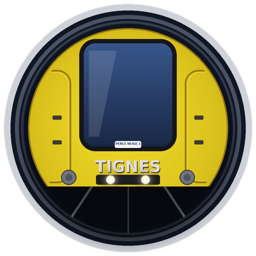

# Perce-Neige Simulator


**Conduisez le plus long funiculaire de France** : 3 474 m de tunnel entre
Val Claret (2 111 m) et le glacier de la Grande Motte (3 032 m), à Tignes.

Simulation physique du funiculaire souterrain *Perce-Neige* (Von Roll / CFD,
construit de 1989 à 1991, ouvert le 14 avril 1993), avec les vrais sons et
les vraies annonces de la cabine. Descendant lointain d'un programme TI-84
de 2006.

*English : the user manual `manuel_perce_neige.pdf` is bilingual (FR/EN) and
the interface switches to English with the `L` key.*

---

## Deux façons de jouer

|                 | PC (Windows)                                                                                   | Web, tablette, téléphone                                               |
|-----------------|------------------------------------------------------------------------------------------------|------------------------------------------------------------------------|
| **Où**          | [Télécharger l'installeur](https://github.com/ARP273-ROSE/perce-neige-sim/releases/latest/download/PerceNeigeSimulator-Setup.exe) (lien permanent) | <https://funiculaire.giff.re>                                          |
| **Quoi**        | Application PyQt6 : pupitre complet, vue de profil, vue cabine 3D intégrée, exploitation automatique, journal d'exploitation | Version 3D Godot 4, tactile (iPad, Android, PC), installable comme application, fonctionne hors ligne |
| **Mise à jour** | Automatique au démarrage                                                                       | Automatique                                                            |

L'installeur s'installe dans le profil utilisateur, sans mot de passe
administrateur. Au premier lancement, Windows peut afficher « Windows a
protégé votre ordinateur » (installeur non signé) : *Informations
complémentaires* puis *Exécuter quand même*. Les mises à jour suivantes ne
le déclenchent plus.

---

## La vraie machine

Sources : Wikipédia (FR + EN), remontees-mecaniques.net, page CFD du
matériel roulant. Détail dans `SOURCES.md`.

| Caractéristique              | Valeur                          |
|------------------------------|---------------------------------|
| Longueur (le long de la pente) | 3 474 m                       |
| Dénivelé                     | 921 m                           |
| Gare basse                   | Val Claret, 2 111 m             |
| Gare haute                   | Glacier de la Grande Motte, 3 032 m |
| Pente maximale               | 30 %                            |
| Vitesse maximale             | 12 m/s (croisière réelle ≈ 10,1 m/s) |
| Rames                        | 2 × 2 voitures couplées         |
| Capacité                     | 334 passagers + 1 conducteur    |
| Masse à vide / en charge     | 32,3 t / 58,8 t                 |
| Motorisation                 | 3 × 800 kW à courant continu, en gare haute |
| Câble                        | Fatzer 52 mm, 22 500 daN nominal, 191 200 daN à la rupture, pas de câble lest |
| Diamètre du tunnel (mini)    | 3,9 m                           |
| Écartement                   | 1 200 mm                        |
| Évitement                    | ≈ 200 m, aiguillages Abt        |
| Constructeur                 | Von Roll / CFD                  |
| Ouverture                    | 14 avril 1993                   |

---

## Ce que simule le programme

- **Physique** : pente variable (8 % en bas, 30 % au milieu, 6 % en haut,
  calée sur la vidéo de cabine), masse selon la charge, résistance au
  roulement et traînée, moteurs à enveloppe P = F·v avec régénération,
  frein de service (2,5 m/s²) et freins de voie (5 m/s²), tension du câble
  et fatigue cumulée, **câble élastique** (rebond à l'arrêt, affaissement à
  l'embarquement), poids propre du câble, contrepoids = l'autre rame.
  Modèle audité et chiffré avec SageMath : `AUDIT_PHYSIQUE_VOYAGES.md`.
- **Régulateur Von Roll** : consigne en % de 12 m/s, enveloppe d'approche
  programmée, rampement à 1 m/s, arrêt au repère, vigilance homme-mort.
- **Tunnel et gares d'après vidéos et photos** : tranchées couvertes carrées
  aux extrémités, alésage tunnelier au milieu, évitement Abt de 1 601 à
  1 823 m, courbes, gares aux parois bleu nuit et caillebotis, salle des
  machines enterrée.
- **Vue cabine 3D** (F4) : viewer Godot embarqué, rien à installer. Rames
  d'après photos (roues Abt à double boudin, phares halogènes, plaque,
  passagers avec skis), vue extérieure (O).
- **Trois modes** : Normal ; Défi (trajet noté sur 100, butoir,
  déraillement, collision) ; Pannes (15 pannes issues d'incidents
  documentés : STRMTG RM5, Glória Lisbonne 2025, Kaprun 2000, Carmelit,
  Perce-Neige 2008…, chacune avec sa procédure de reprise).
  `AUDIT_PHYSIQUE_PANNES.md` détaille le modèle.
- **Exploitation automatique** (X) : journée complète de 08:45 à 16:45,
  embarquement, fermeture, trajet, croisement, stabilisation du câble à
  l'arrivée, demi-tour ; journal SQLite consultable (F5). Maj+X = 24/7.
  La touche A confie un seul voyage au pilote automatique.
- **Sons** : ambiance réelle de la cabine, buzzers, annonces authentiques en
  cinq langues (console F2), sons d'accident synthétisés.
- **Autour** : mise à jour automatique, rapports d'incident anonymes (avec
  votre accord), téléchargement des PDF (F6), interface FR/EN.

---

## Commandes (PC)

L'écran d'accueil (F1) reprend ces touches.

**Conduite**

| Touche            | Action                                          |
|-------------------|-------------------------------------------------|
| `↑` / `↓`         | Consigne de vitesse ± (% de 12 m/s)             |
| `Espace` / `B`    | Frein de service (maintenir)                    |
| `Maj`             | Frein d'urgence, freins de voie (maintenir)     |
| `3`               | Arrêt électrique (verrouillé)                   |
| `4`               | Arrêt d'urgence (verrouillé)                    |
| `V`               | PRÊT                                            |
| `Z`               | DÉPART : portes, buzzer, traction               |
| `I`               | Inverser le sens (à l'arrêt)                    |
| `W`               | Vigilance marche / arrêt                        |
| `G`               | Acquitter la vigilance                          |

**Cabine**

| Touche            | Action                                          |
|-------------------|-------------------------------------------------|
| `D`               | Portes (à l'arrêt)                              |
| `H`               | Phares                                          |
| `C`               | Éclairage cabine                                |
| `K`               | Klaxon (maintenir)                              |
| `A`               | Pilote automatique du voyage                    |
| `X`               | Exploitation automatique                        |
| `Maj+X`           | 24/7, ignorer les horaires                      |
| `N`               | Silence annonces                                |
| `Retour arrière`  | Couper l'annonce en cours                       |
| `F2`              | Console des annonces                            |
| `F4`              | Vue cabine : profil → dessinée → 3D             |
| `O`               | Vue extérieure 3D (glisser, molette)            |

**Système**

| Touche            | Action                                          |
|-------------------|-------------------------------------------------|
| `P` / `Échap`     | Pause                                           |
| `M`               | Mode : normal / défi / pannes                   |
| `F`               | Sélecteur de pannes (mode pannes)               |
| `R` / `Entrée`    | Nouveau voyage / démarrer depuis l'écran-titre  |
| `Début`           | Retour à l'écran-titre                          |
| `F1`              | Aide                                            |
| `F3`              | La vraie machine, liens                         |
| `F5`              | Journal d'exploitation                          |
| `F6`              | Télécharger manuel et guide théorique (PDF)     |
| `+` / `−` / `0`   | Zoom de la vue de profil (ou molette)           |
| `L`               | Langue FR / EN                                  |
| Menu Aide         | Mise à jour, signaler un problème, à propos     |

---

## Documentation

- `manuel_perce_neige.pdf` : manuel utilisateur, FR/EN, 44 pages.
- `guide_theorique.pdf` : formules, sources réglementaires, calibration audio.
- `AUDIT_PHYSIQUE_VOYAGES.md`, `AUDIT_PHYSIQUE_PANNES.md` : audits du
  modèle physique, scripts SageMath et sorties dans `audit_physique/`.
- `SOURCES.md`, `research_*.md` : sources techniques et historiques.
- `CHANGELOG.md` : journal des versions.

---

## Depuis les sources

```cmd
launch.bat        (Windows)
./launch.sh       (Linux / macOS)
```

Les lanceurs créent un environnement virtuel hors du dossier, installent
PyQt6 et Pillow, puis lancent le jeu. À la main :

```bash
pip install -r requirements.txt
python perce_neige_sim.py
```

- **Viewer 3D** : le binaire `bundled_godot/` (~125 Mo) n'est pas dans le
  dépôt. Au premier F4, l'application propose de le télécharger depuis la
  dernière release (contrôle SHA-256). Sinon : Godot 4.6 installé, ou
  `./build_godot_viewer.sh`. Sans viewer, F4 retombe sur la vue cabine
  dessinée.
- **Tests** : `QT_QPA_PLATFORM=offscreen pytest tests` ; bancs Godot :
  `godot --headless --path godot_project -s bench_<nom>.gd`.
- **Version Web** : `bash deploy_web.sh` (export Web Godot, puis copie sur
  le serveur).
- **Release PC** : un tag `v*` déclenche GitHub Actions
  (`.github/workflows/build.yml`), qui construit l'installeur et le publie.

---

## Licence

MIT. Auteur : ARP273-ROSE, original TI-Basic 2006, portage PyQt6 2026.
